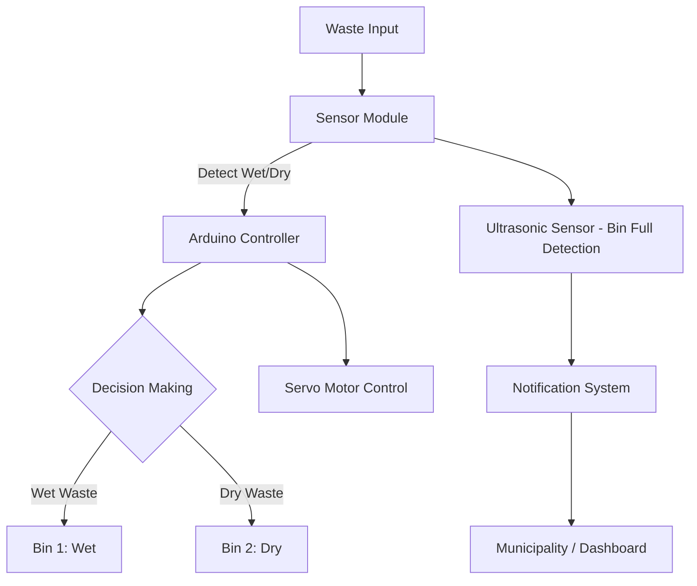

# ♻️ Smart Waste Segregation IoT System

## 📘 Project Overview

Smart Waste Segregation is an IoT-based system that autonomously classifies waste into **wet** and **dry** categories. The system helps improve recycling rates, reduce landfill usage, and protect waste workers from hazardous exposure by minimizing manual sorting.

---

## 🔧 Features & Highlights

- **Real-time classification** using sensors (moisture, ultrasonic)  
- **Servo motor control** to divert waste into correct bins  
- **Alerts/Notifications** sent to municipal authorities when bins are full  
- Web/UI dashboard or LCD display for monitoring  
- Accuracy target: ≥ 90%  
- Modular and scalable for deployment in smart cities

---

## 🛠️ System Architecture

## 📊 Block Diagram

This will render a **flowchart-style block diagram** directly on GitHub with clear modules:

- Waste Input  
- Sensor Module  
- Arduino Controller  
- Servo Motor + Waste Bins  
- Notification System

### Main Components

| Component        | Role                                                   |
|------------------|---------------------------------------------------------|
| Ultrasonic Sensor | Detects presence/distance of incoming waste             |
| Moisture Sensor   | Differentiates wet vs dry waste                         |
| Servo Motor        | Mechanically diverts waste into proper bins           |
| Arduino Uno        | Central controller to read sensors & control actuators |
| LCD / UI          | Displays system status and sensor readings              |
| Communication      | Sends bin-full alerts to the municipality             |

---

## 🧪 How to Run / Deploy

1. Connect hardware: sensors, servo, Arduino  
2. Upload Arduino firmware from `code/Segregator.ino`  
3. Calibrate sensors (moisture threshold, distance cutoffs)  
4. Power up and test with sample waste items  
5. Monitor readings on UI / LCD and verify sorting  

---

## ✍️ Authors & Contact

- Nirosha K. — nirosha.kunduru@gmail.com
- Chandra Shekar K. — chandrashekar63707@gmail.com 
- Vaishnavi S. — vaishnavisamkula@gmail.com  
- Seshu Kumar K. — seshu478@gmail.com   
- Ram Teja M. — ramteja@gmail.com  

Department of AI, Vidya Jyothi Institute of Technology, Hyderabad

---

## 📚 References

1. M R Chitale et al. “Automated Smart Waste Segregation using IoT”, *Journal of Physics: Conference Series*, 2023  
2. Gayathri Rajakumaran et al. “Smart Waste Management: Waste Segregation using ML”, *RAWCET 2022*  
3. Aatmaj A. Salunke, “Waste-Seg-Net: Deep Learning for Waste Segregation”, 2023

---

  

---

Thank you for visiting! We welcome contributions, issues, and ideas to expand this system for greater impact.  
